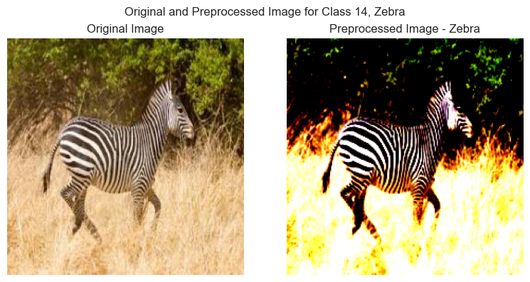
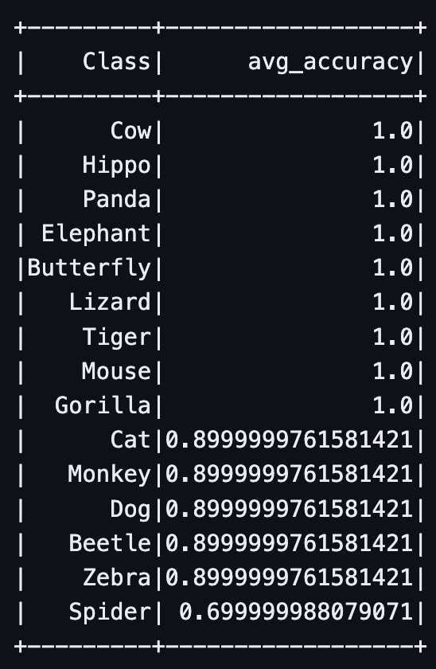

# DeepLearningPipeline - Multi-Class Animal Classification

## Table of Contents

1. [Introduction](#introduction)
2. [Data](#data)
3. [Model](#model)
4. [Google Cloud Platform, Apache Airflow, and MongoDB](#google-cloud-platform-apache-airflow-and-mongodb)
5. [Model Validation](#model-validation)
6. [Conclusion](#conclusion)
7. [References](#references)

## Introduction

We wanted to create an end-to-end pipeline that can demonstrate how to build a modern deep learning project that can use a Cloud Storage Service, automate tasks using Apache Airflow, aggregate results with MongoDB and train a fine-tuned Deep Learning Model from Hugging Face.

## Data

The [Multi-Label Animal Classification](https://www.kaggle.com/datasets/utkarshsaxenadn/animal-image-classification-dataset) data we will be using can be found on kaggle. The Training Data consists of 15 clases (Beetle, Butterfly, Cat, Cow, etc.) with 2000 images each, while the Validation Data has 100-200 per class. The images are in standard .jpg format and stored in class folders.

## Model

For our multi-label classification model, we will be using PyTorch along with; the Hugging Face's [Transformers](https://huggingface.co/transformers/) library. The model we will be using is the [ResNet50](https://huggingface.co/microsoft/resnet-50) model, which is a pre-trained model that has been trained on ImageNet.

```python
import torch.nn as nn
from transformers import ResNetForImageClassification
model = ResNetForImageClassification.from_pretrained("microsoft/resnet-50")
```

We have alternated the last layer of the model to fit our 15 classes instead of the original 1000 classes.

```python
model.classifier[1] = nn.Linear(in_features=2048, out_features=15, bias=True)
```

The model was trained for the task at hand was able to acomplish a final accuracy of about 95% for the majority of classes. The best model was saved and would be used to monitor the model health over a period of time.



## Google Cloud Platform, Apache Airflow and MongoDB

We used Google Cloud Platform (GCP) to store a subset of our validation data and Apache Airflow to automate our pipeline so we could integrate the benefits of MongoDB NoSQL Database to our system.

Our Dags consisted of 2 steps:

1) Retrieving the stored validation images from GCP and create a MongoDB collection of the path names for each image label.

    - {"_id":{"$oid":"65ea77f89d9f5449870d04c7"},\
    "label":"Beetle",\
    "image_path":"gs://good_data_things/val_small/Beetle/Beatle-Valid_(108).jpeg"}

2) The next step created an aggregation of the MongoDB collection by sampling 10 images per class and storing it to a CSV file for our model to evaluate.

## Model Validation

For the model validation. We had manually run the aggregated results due to an issue with Google Cloud Composer and our Python Environment. However, if we were to overcome this issue we would run this along with the Apache Airflow DAG as we do in practice.

Overall, after 7 days of monitoring the model, our model's performance resulting in the following:
<center>
    
</center>

From our monitoring, our model performs well on the majority of classes. However, the spider class performs much worse than all the others. This leads us to determine that we may need much more training on spider images because they are not being accuractly classified.

## Conclusion

*{Insert more details here}*


## References

1. [Multi-Label Animal Classification](https://www.kaggle.com/datasets/utkarshsaxenadn/animal-image-classification-dataset)
2. [Transformers](https://huggingface.co/transformers/)
3. [ResNet50](https://huggingface.co/microsoft/resnet-50)
